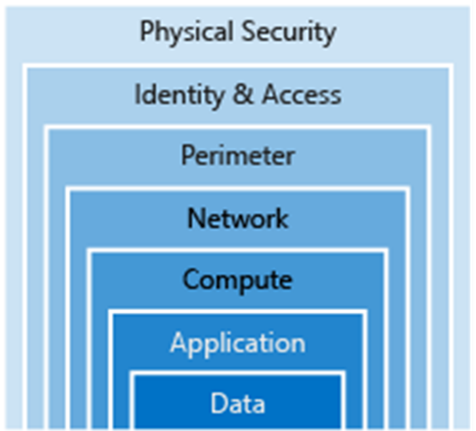

# DP 200 - Implementing a Data Platform Solution
# Lab 8 - Securing Azure Data Platform

## Exercise 1: An introduction to security
### Task 1: Security as a layered approach

Below is a diagram that represents the layered support to security:

From the course content, case study and the scenarios taken in the course so far, spend 10 minutes in a group identify the layers of security that you have impacted so far to secure AdventureWorks in the labs. Find three examples.

|Task |	High level security task |Layer|
|---:|---|---|
| 1	 | Set access levels to blob containers  | data  |
| 2	 | Use Storage Account Keys to control access to Azure Blob or Data Lake Storage  | Data  |
| 3	 | Create an application registration in Azure Active Directory  | Application  |
| 4	 | Access Controll (IAM) management of application  |  Identity & Access |
| 5	 | Use Azure Sign in to connect Visual Studio code with Cosmos DB | Identity & Access |
| 7	 | Define a user name and password for access to SQL Database and SQL Data Warehouse | Identity & Access |
| 8	 | Configure a SQL Service Firewall | Network |
| 9	 | Create a Database scope credential | Identity & Access |
| 10 | Creating Event Hub Shared access policies | Identity & Access |
| 11 | Application accounts security (Telecom datagenerator or Twitter API) | Application |

Which security layers have we not dealt with in this course? Can you make a suggestion of what you would do in this area?

| # |Layer |	Suggestion|
|---|---|---|
| 1 | Physical Security | Consider the physical security of staff laptops that hold data |		
| 2 | Perimeter |  Work with the infrastructure Engineers to configure Perimeter security of the netwrok. NAT, Vnet security etc. |		
| 3 | Compute | Work with Azure Engineers to restrict the permission to Compute resources such as Databricks  |

## Exercise 3: Securing Storage Accounts and Data Lake Storage
### Task 1: Determining the appropriate security approach for Azure Blob

You have been approached by your in-house web developer to help her to give access to a third-party web design company to the web images that are in the awsastudxx storage account. As a senior data engineer within AdventureWorks, what steps would you need to take to ensure this can happen while apply the correct due diligence.

|Step # | High level step |
|---:|---|
| 1 |	In Microsoft Edge, click on the Azure portal tab, click Resource groups, and then click awrgstudxx, and then click on awdlsstudxx, where xx are your initials. |
| 2 |	In the awdlsstudxx blade, click on **Shared Access Signature**. |
| 3 |	Configure the appropriate security and setting for the **Shared Access Signature** |
| 4 |	Click on **Generate SAS** and connection string |
| 5 |	Collect the connection strings and securely transfer it to the third-party web company.